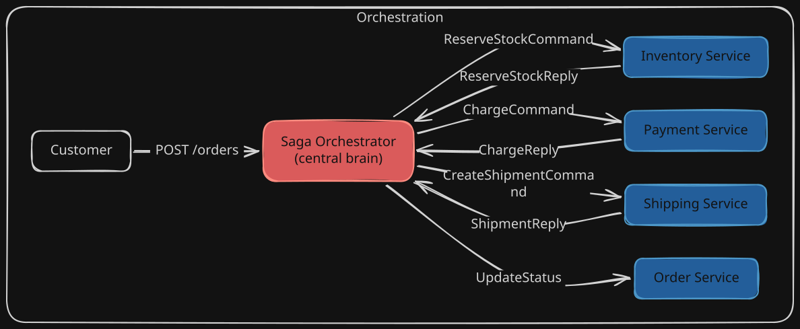
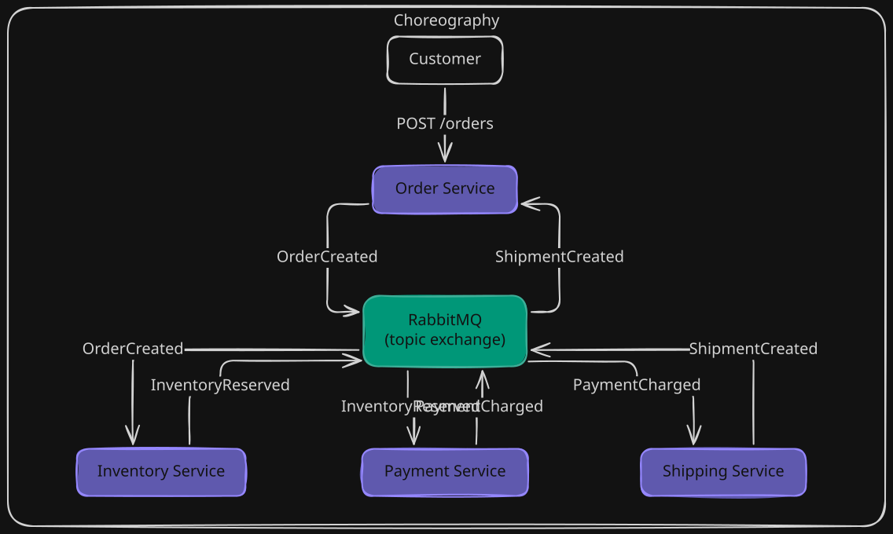
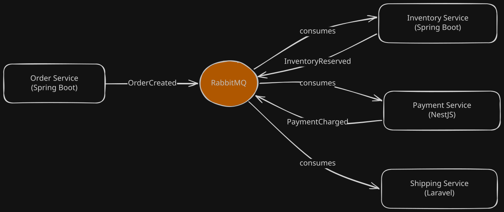
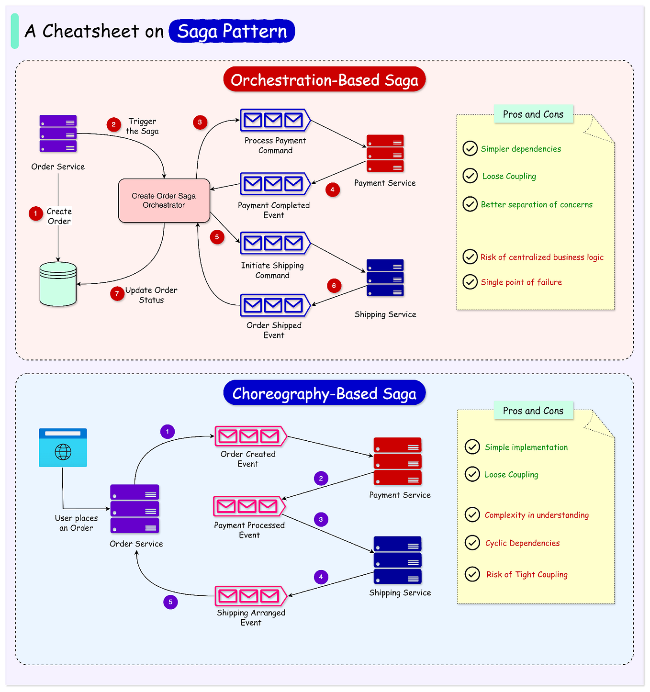
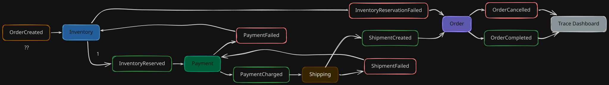

# ADR-001: Choreography over Orchestration

## Context

I am building Chorus - an event-driven order system composed of four microservices written in three different languages:

| Service | Stack | Role |
|---|---|---|
| Order | Spring Boot (Java 21) | Owns the order lifecycle, correlation IDs, terminal state |
| Inventory | Spring Boot (Java 21) | Atomic stock reservation and release |
| Payment | NestJS (TypeScript) | Charge and refund via a payment gateway |
| Shipping | Laravel (PHP) | Address validation, carrier integration, shipment creation |

These services must coordinate a distributed transaction - the Saga - to take an order from creation through inventory reservation, payment, shipping, and finally completion. There is no shared database. Each service owns its own Postgres instance. The fundamental question I needed to answer before writing a single line of business logic was: **how do these services coordinate?**

There are exactly two patterns for implementing a Saga in a distributed system:

1. **Orchestration** - a dedicated coordinator service tells each participant what to do, when to do it, and handles failure by issuing explicit rollback commands.
2. **Choreography** - no coordinator exists. Each service reacts to domain events published by other services, performs its local work, and emits its own events. The "saga" emerges from the chain of reactions.

This ADR documents my decision to use choreography, why I believe it is the right choice for this specific system, and the concrete tradeoffs I accept.

---

## What Orchestration Actually Looks Like

In an orchestrated saga, there is a dedicated `SagaOrchestrator` service (sometimes embedded inside the Order service, sometimes standalone). This orchestrator holds a state machine representing the saga's progress. It sends explicit **commands** to each service and **waits for replies**. The orchestrator alone knows the full sequence of steps.

Here is what the orchestrator's logic looks like in practice:

```java
// OrderSagaOrchestrator.java (Spring Boot)
// This class owns the ENTIRE transaction flow.
// Every service is a puppet - it does what the orchestrator tells it.

@Service
public class OrderSagaOrchestrator {

    private final InventoryClient inventoryClient;   // synchronous or async RPC
    private final PaymentClient paymentClient;
    private final ShippingClient shippingClient;
    private final SagaStateRepository sagaRepo;

    public void executeSaga(Order order) {
        SagaState state = sagaRepo.create(order.getId(), "STARTED");

        // Step 1: Command inventory to reserve
        try {
            ReserveStockResponse res = inventoryClient.reserveStock(
                new ReserveStockCommand(order.getId(), order.getItems())
            );
            state.setReservationId(res.getReservationId());
            state.setPhase("INVENTORY_RESERVED");
            sagaRepo.save(state);
        } catch (ReservationFailedException e) {
            state.setPhase("FAILED");
            sagaRepo.save(state);
            return; // nothing to compensate yet
        }

        // Step 2: Command payment to charge
        try {
            ChargeResponse res = paymentClient.charge(
                new ChargeCommand(order.getId(), order.getTotalCents())
            );
            state.setPaymentId(res.getPaymentId());
            state.setPhase("PAYMENT_CHARGED");
            sagaRepo.save(state);
        } catch (PaymentFailedException e) {
            // Compensate step 1
            inventoryClient.releaseStock(
                new ReleaseStockCommand(state.getReservationId())
            );
            state.setPhase("COMPENSATED");
            sagaRepo.save(state);
            return;
        }

        // Step 3: Command shipping to create shipment
        try {
            ShipmentResponse res = shippingClient.createShipment(
                new CreateShipmentCommand(order.getId(), order.getAddress())
            );
            state.setPhase("COMPLETED");
            sagaRepo.save(state);
        } catch (ShipmentFailedException e) {
            // Compensate steps 2 and 1
            paymentClient.refund(new RefundCommand(state.getPaymentId()));
            inventoryClient.releaseStock(
                new ReleaseStockCommand(state.getReservationId())
            );
            state.setPhase("COMPENSATED");
            sagaRepo.save(state);
        }
    }
}
```

Notice what is happening here. The orchestrator knows the exact sequence. It knows that inventory comes before payment. It knows that if shipping fails, it must refund before releasing stock. It holds a `SagaState` that tracks where the transaction is at any point. Every participant service exposes a command/reply interface - either synchronous HTTP endpoints or request/reply queues that the orchestrator calls.

This means the orchestrator needs **typed client libraries** for every downstream service: `InventoryClient`, `PaymentClient`, `ShippingClient`. Each client must know the command shape (`ReserveStockCommand`), the reply shape (`ReserveStockResponse`), and the error shape (`ReservationFailedException`). In a monoglot Java system, these might be shared Maven dependencies. But in my polyglot system, the Payment service is TypeScript and the Shipping service is PHP - I would need to maintain parallel client implementations or resort to code generation, adding a cross-language build dependency that does not need to exist.

---

## What Choreography Looks Like

In my choreographed system, there is no orchestrator. Each service simply listens for events it cares about, does its job, and publishes what happened. No service tells another service what to do.

Here is the equivalent flow expressed as independent event handlers in each service:

```java
// InventoryEventHandler.java (Spring Boot)
// I don't know or care who published OrderCreated.
// I don't know what happens after I emit InventoryReserved.

@RabbitListener(queues = "inventory.order-created")
public void onOrderCreated(OrderCreatedEvent event) {
    if (alreadyProcessed(event.getEventId())) return;

    boolean reserved = inventoryService.tryReserve(event.getItems());

    if (reserved) {
        outbox.save(new InventoryReservedEvent(event.getCorrelationId(), ...));
    } else {
        outbox.save(new InventoryReservationFailedEvent(event.getCorrelationId(), ...));
    }

    markProcessed(event.getEventId());
}
```

```typescript
// payment.consumer.ts (NestJS)
// I react to InventoryReserved. I have no idea who Inventory is.
// I just know the event shape.

@RabbitSubscribe({ queue: 'payment.inventory-reserved' })
async handleInventoryReserved(event: InventoryReservedEvent) {
  if (await this.alreadyProcessed(event.event_id)) return;

  const result = await this.paymentService.charge(
    event.payload.order_id,
    event.payload.amount_cents
  );

  if (result.success) {
    await this.outbox.save(new PaymentChargedEvent(event.correlation_id, ...));
  } else {
    await this.outbox.save(new PaymentFailedEvent(event.correlation_id, ...));
  }

  await this.markProcessed(event.event_id);
}
```

```php
// ShipmentCreatedListener.php (Laravel)
// I react to PaymentCharged. I know nothing about the saga.

class PaymentChargedListener implements ShouldQueue
{
    public function handle(PaymentChargedEvent $event): void
    {
        if (ProcessedEvent::exists($event->event_id)) return;

        $result = ShipmentService::create($event->payload['order_id']);

        if ($result->success) {
            Outbox::save(new ShipmentCreatedEvent($event->correlation_id, ...));
        } else {
            Outbox::save(new ShipmentFailedEvent($event->correlation_id, ...));
        }

        ProcessedEvent::record($event->event_id);
    }
}
```

The critical difference: **no service knows the full saga**. Inventory does not know that payment comes after it. Payment does not know that shipping comes next. Each service reacts to a single event, does its bounded work, and publishes the outcome. The saga "emerges" from the chain of event reactions, the same way a crowd does a wave in a stadium - no one is conducting it, each person just reacts to the person next to them.

---

## Side-by-Side Comparison

These two diagrams illustrate the structural difference between orchestration and choreography in Chorus.

### Orchestration (rejected)



Every arrow passes through the orchestrator. It is the single brain. If it goes down, the entire saga halts. If I want to add a step (say, a Fraud Detection service between Payment and Shipping), I must modify the orchestrator's state machine, redeploy it, and ensure its new client library works.

### Choreography (chosen)



Every service talks to the broker, not to each other. The broker is dumb infrastructure - it routes messages, it does not understand sagas. Adding a Fraud Detection service means: deploy the new service, have it bind to `inventory.reserved`, have it emit `FraudCheckPassed`, and update Payment to listen to `FraudCheckPassed` instead of `inventory.reserved`. I never touch the other services.

---

## Decision

I chose **choreography** for the Chorus system.




---

## Why Choreography Is Specifically Safe in a Polyglot System

This is perhaps the most important reason for my choice, and the one that is most specific to Chorus.

My services are written in three languages:
- **Java 21** (Order, Inventory) - using Spring AMQP for RabbitMQ
- **TypeScript** (Payment) - using `@golevelup/nestjs-rabbitmq` for RabbitMQ
- **PHP 8** (Shipping) - using `php-amqplib/php-amqplib` for RabbitMQ

### The polyglot problem with orchestration

If I had an orchestrator, it would need to send commands to and receive replies from all three runtimes. This creates one of two painful situations:

**Option A: Synchronous HTTP commands.** The orchestrator calls `POST /inventory/reserve`, `POST /payment/charge`, etc. Now I have synchronous coupling between the orchestrator and every service. If Payment is slow, the orchestrator thread blocks. If Shipping is down, the orchestrator must implement retries, circuit breakers, and timeouts - per service, per language runtime, each with different failure characteristics. The NestJS service might return a 502 from a different middleware stack than the Spring Boot service. The Laravel service might have different timeout defaults. I am now debugging cross-language HTTP semantics instead of business logic.

**Option B: Async command/reply via RabbitMQ.** The orchestrator publishes a `ReserveStockCommand` to a queue and waits for a `ReserveStockReply` on a reply queue. This is better, but I still need command and reply contracts that both sides agree on. The orchestrator (probably Java) needs to serialize `ReserveStockCommand` in a way the Inventory service (also Java, fine) can deserialize. But it also needs `ChargeCommand` that the NestJS Payment service can deserialize, and `CreateShipmentCommand` that the Laravel Shipping service can deserialize. These are **bilateral contracts** - each pair (orchestrator + service) must agree on the exact command schema, the reply schema, and the error schema. In a monoglot system, you might share a Maven artifact with the DTOs. In a polyglot system, you are maintaining three separate command/reply serialization implementations that must stay in sync. This is the kind of invisible coupling that causes bugs at 3 AM on a Friday.

### Why choreography eliminates this coupling

In choreography, the contract is the **event**. The event is published to RabbitMQ as a JSON payload. Any service that can deserialize JSON can consume it. The contract is:

1. The routing key (e.g., `order.created`)
2. The JSON shape of the event envelope (six fields, documented in ADR-002)
3. The JSON shape of the payload (documented in `events.md`)

That is the entire integration surface. My Spring Boot producer serializes `OrderCreated` to JSON. My Spring Boot consumer (Inventory) deserializes it from JSON. My NestJS consumer (Payment, in a different step) deserializes `InventoryReserved` from JSON. My Laravel consumer (Shipping) deserializes `PaymentCharged` from JSON. None of them need to know each other's type system. None of them import a shared library. The broker does not care whether the producer was Java, TypeScript, or PHP - it just routes bytes.

This is not a theoretical benefit. I proved it during Phase 1 when I defined the event contracts in `events.md`. I was able to write complete JSON examples for every event without thinking about which language would produce or consume them. The contract is language-neutral by construction. If I had been designing command/reply DTOs, I would have been constantly thinking about how Java's `BigDecimal` maps to TypeScript's `number` maps to PHP's `float` - which is exactly why I chose integer cents for money representation.

### The AMQP client library story

All three of my languages have mature, battle-tested AMQP 0-9-1 client libraries:

| Language | Library | Maturity |
|---|---|---|
| Java | Spring AMQP / `amqp-client` | 15+ years, deeply integrated with Spring Boot auto-configuration |
| TypeScript | `amqplib` (via `@golevelup/nestjs-rabbitmq`) | Well-maintained, full AMQP support, good NestJS integration |
| PHP | `php-amqplib/php-amqplib` | Maintained by the RabbitMQ team themselves, the canonical PHP client |

Every one of these libraries supports publishing to a topic exchange, binding queues with routing keys, acknowledging messages, and configuring dead-letter exchanges. The RabbitMQ protocol (AMQP 0-9-1) is the contract - not any language-specific SDK. This is a direct contrast to, say, gRPC, where the protobuf-generated stubs create language-specific coupling that an orchestrator would depend on.

---

## Why RabbitMQ Specifically

### RabbitMQ vs Kafka

Kafka is a log-based broker. It is excellent at high-throughput event streaming, replay from any offset, and long-term event storage. But my system has specific characteristics that make RabbitMQ a better fit:

**1. Topic exchange routing is a natural fit for choreography.**
RabbitMQ's topic exchange lets each service bind its queue to exactly the routing keys it cares about. Inventory binds to `order.created`, `payment.failed`, and `payment.refunded`. Payment binds to `inventory.reserved` and `shipment.failed`. This is declarative, fine-grained, and visible in the RabbitMQ management UI. In Kafka, I would need to either: (a) create a separate topic per event type (11 topics, each with partition management overhead), or (b) put all events on a single topic and have every consumer filter client-side, wasting CPU on events it does not care about.

**2. Per-message acknowledgment and DLQ.**
When my Inventory consumer fails to process an `OrderCreated` event (say, the database is temporarily down), I want that specific message to be requeued or routed to a dead-letter queue after N retries. RabbitMQ supports this natively with per-message `nack`, `reject`, and dead-letter exchange (DLX) configuration. Kafka's consumer offset model is partition-based - if I fail to process offset 42, I cannot advance to offset 43 without either skipping 42 (data loss) or blocking the entire partition (head-of-line blocking). For saga compensation, where every single event matters, per-message semantics are essential.

**3. I do not need event replay from a log.**
Kafka's killer feature is the ability to replay events from any offset. But I am building a saga system with the transactional outbox pattern, not a CQRS/event-sourcing read model that needs to rebuild state from history. My consumers process events exactly once (idempotently) and move on. If I need to trace what happened, I use the Saga Trace Dashboard, which stores a copy of every event anyway. I do not need the broker itself to be a durable log.

**4. Scale and operational complexity.**
Kafka requires ZooKeeper (or KRaft for newer versions), careful partition planning, and significant operational investment to run well. RabbitMQ runs as a single container in my `docker-compose.yml` with a management UI out of the box. For a learning project with four services and maybe a few hundred events per test run, Kafka's operational overhead is pure waste.

### RabbitMQ vs Redis Streams

Redis Streams (since Redis 5.0) offer consumer groups and message acknowledgment, which looks superficially similar to what I need. But:

**1. No native topic routing.**
Redis Streams requires me to implement routing logic in application code. I would need a stream per event type and manual consumer subscription management. RabbitMQ's exchange/binding/queue model gives me this for free.

**2. Durability guarantees.**
Redis is primarily an in-memory store. Persistence (RDB snapshots, AOF) is possible but not the default, and under certain failure modes (e.g., crash between writes and fsync), messages can be lost. RabbitMQ with `publisher confirms` and `durable queues` gives me stronger delivery guarantees out of the box, which I need for financial transactions (payment charging and refunding).

**3. No built-in dead-letter routing.**
Redis has no native DLQ mechanism. I would need to implement retry logic, poison message detection, and dead-letter routing entirely in application code across three languages. RabbitMQ's DLX/DLQ is a broker-level configuration - I set it once and it works for every queue, regardless of which language the consumer is written in.

**4. AMQP client ecosystem.**
The AMQP 0-9-1 client libraries for Java, TypeScript, and PHP are mature and well-documented. Redis client libraries exist for all three languages, but their Streams support varies in quality and ergonomics, especially for consumer groups with acknowledgment.

---

## The Observability Problem and My Plan to Solve It

This is the single biggest tradeoff of choreography, and I want to be honest about it.

In an orchestrated saga, observability is free. The orchestrator holds a `SagaState` row with the current phase (`STARTED`, `INVENTORY_RESERVED`, `PAYMENT_CHARGED`, `COMPLETED`, `COMPENSATED`). If I want to know the status of order X, I query the orchestrator's database. If a saga is stuck, I can see which phase it is stuck in. The orchestrator is both the coordinator and the monitoring surface.

In my choreographed system, there is no single place that knows the full state of a saga. The Order service knows that it created an order with status `pending`. The Inventory service knows that it reserved stock. The Payment service knows that it charged the customer. But no single database row tells me: "Order X has been paid but not yet shipped." To reconstruct this, I would need to query all four databases and piece together the timeline from individual records. This is terrible.

### My mitigation: the Saga Trace Dashboard

I plan to build a lightweight, read-only service that solves this by subscribing to **every event** on the `chorus.events` exchange using the `#` wildcard routing key. Every event - `OrderCreated`, `InventoryReserved`, `PaymentCharged`, `ShipmentCreated`, and all failure/compensation events - gets stored in a single `event_trace` table, keyed by `correlation_id`.

```
GET /trace/f47ac10b-58cc-4372-a567-0e02b2c3d479

{
  "correlation_id": "f47ac10b-58cc-4372-a567-0e02b2c3d479",
  "events": [
    { "event_type": "OrderCreated",       "service": "order",     "occurred_at": "2026-07-31T17:00:00Z" },
    { "event_type": "InventoryReserved",  "service": "inventory", "occurred_at": "2026-07-31T17:00:01Z" },
    { "event_type": "PaymentCharged",     "service": "payment",   "occurred_at": "2026-07-31T17:00:02Z" },
    { "event_type": "ShipmentCreated",    "service": "shipping",  "occurred_at": "2026-07-31T17:00:03Z" },
    { "event_type": "OrderCompleted",     "service": "order",     "occurred_at": "2026-07-31T17:00:04Z" }
  ],
  "status": "completed",
  "duration_ms": 4000
}
```

This gives me a complete, chronological view of every saga. If a saga is stuck (say, `OrderCreated` and `InventoryReserved` exist, but `PaymentCharged` never arrived), I can immediately see the gap and investigate the Payment service.

The trace dashboard also lets me detect anomalies at scale:
- Sagas that have been in a non-terminal state for more than N minutes (stale/stuck detection)
- Sagas where compensation events arrived but the terminal `OrderCancelled` event never did
- Event ordering violations (e.g., `PaymentCharged` arriving before `InventoryReserved` due to a consumer bug)

This is more work than the orchestrator's built-in observability. I accept that cost because the observability problem is bounded and solvable, while the coupling problem of orchestration in a polyglot system is structural and ongoing.

---

## The Cyclic Dependency Risk and How I Mitigate It

In choreography, cyclic event chains are a real danger. If Service A reacts to an event from Service B by emitting an event that Service B also listens to, and Service B reacts by emitting the original event again, I have an infinite loop. This is not theoretical - it is one of the most common failure modes in choreographed systems.

### How a cycle could form in Chorus

Consider a naive design where I am not careful:

1. `PaymentFailed` is consumed by Inventory, which emits `InventoryReleased`.
2. Suppose I also had Order consuming `InventoryReleased` and emitting some event.
3. And suppose Inventory also consumed that event.

Now I have a cycle: Payment -> Inventory -> Order -> Inventory -> ...

### My mitigation strategy

I prevent cycles through three deliberate design constraints:

**1. Strict event directionality in the saga flow.**
My happy path is a strict pipeline: Order -> Inventory -> Payment -> Shipping -> Order. Events only flow forward. Compensation events flow backward along the same chain but they are **different event types** with different routing keys. `InventoryReserved` and `InventoryReleased` are not the same event. No service reacts to both the forward and backward version of the same step in a way that would re-trigger the forward step.

**2. Terminal events are consumed only by the trace dashboard.**
`OrderCompleted` and `OrderCancelled` are terminal events. No business service reacts to them. They exist solely for the Order service to record its final state and for the Saga Trace Dashboard to close out the trace. If I allowed a business service to react to `OrderCancelled` (say, to send a notification), that service could theoretically emit an event that re-triggers the saga. I avoid this by keeping terminal events out of the business reaction chain.

**3. Compensation events carry a `reason` field that distinguishes them.**
My `InventoryReleased` event includes a `reason` field (e.g., "Payment failed - releasing reserved stock"). This is not just for logging. If I ever need a service to distinguish between "inventory was released because payment failed" and "inventory was released because a shipment failed" to take different actions, the reason field prevents ambiguous re-triggering.

**4. Each event type is consumed by at most two services.**
I documented the full consumer binding table in `events.md`. No event is consumed by more than two services, and the two consumers never produce the same output event. This limits the blast radius of any event and makes the dependency graph tractable to reason about by hand.

Here is the dependency graph:



The compensation path (`ShipmentFailed` -> Payment, `PaymentFailed` -> Inventory) does not create a cycle because these paths terminate differently than the forward path. `PaymentFailed` causes Inventory to emit `InventoryReleased` (not `InventoryReserved`), and `InventoryReleased` is consumed by Order, which emits the terminal `OrderCancelled`. The chain is finite and acyclic.

---

## Real-World Parallels

I did not make this decision in a vacuum. I studied how other organizations have approached this problem.

### Companies that use choreography successfully

**Netflix** uses choreographed event-driven architectures extensively. Their Conductor framework (which is actually an orchestrator) was built later specifically because they found choreography hard to debug at massive scale - but they started with choreography and it worked for years. The lesson I take from Netflix is not "choreography failed" but rather "choreography worked until they had thousands of services, at which point the observability cost became untenable." I have four services.

**Uber** built their earliest trip lifecycle as a choreographed system. Their services reacted to events like `TripRequested`, `DriverAssigned`, `TripStarted`, `TripCompleted`. They eventually built Cadence (now Temporal) to orchestrate some of their more complex workflows - but this was driven by workflows with 20+ steps and conditional branching, not simple linear sagas. My saga has four steps.

**Shopify** uses choreographed event-driven communication extensively between their service domains. Their approach of defining clear domain events and letting services react independently scales to their thousands of engineers because each team owns their consumers.

### When companies switch to orchestration

The pattern I see in industry is:

1. **Start choreographed** - when the saga is simple (< 10 steps), linear, and the team is small.
2. **Switch to orchestration** - when the saga gains conditional branching ("if the customer is international, add a customs clearance step"), parallel execution ("charge payment AND verify address simultaneously"), or when the number of steps exceeds what a human can trace through the event chain.

My saga is a four-step linear pipeline with three possible failure points. This is squarely in the territory where choreography works well. If Chorus ever grew to need conditional branching (e.g., "if order > $500, require manager approval"), I would revisit this decision. But I am designing for the system I am building, not a hypothetical future system.

---

## Specific Tradeoffs I Accept

I want to be explicit about what I give up and why I believe each tradeoff is acceptable for this project.

### 1. Observability is harder
**Cost:** I cannot query a single database to see the state of a saga. I must build the Saga Trace Dashboard  to compensate.
**Why I accept it:** Building the trace dashboard is itself a valuable learning exercise. It teaches me event sourcing concepts (rebuilding state from a stream of events), which is a transferable skill. In an orchestrated system, I would get observability for free but learn less.

### 2. End-to-end testing requires the full system running
**Cost:** To test the happy path end-to-end, I need all four services, RabbitMQ, and four Postgres databases running. In an orchestrated system, I could test the orchestrator in isolation by mocking the command/reply interfaces.
**Why I accept it:** Docker Compose makes standing up the full system trivial. My `docker-compose.yml` already runs RabbitMQ and Postgres. Adding the four services is straightforward. The integration test surface is more realistic than mocked unit tests of an orchestrator.

### 3. Debugging a stuck saga requires correlating events across services
**Cost:** If an order is stuck in `pending`, I need to check: Did Inventory receive the `OrderCreated` event? Did it publish `InventoryReserved`? Did Payment receive it? I might need to check the RabbitMQ management UI, the DLQ, and multiple service logs.
**Why I accept it:** This is exactly the kind of debugging skill that is valuable in real distributed systems. An orchestrator hides this complexity - which is great for production velocity but bad for learning. I am deliberately choosing the harder path because the debugging skills are the point.

### 4. The saga flow is implicit, not declared in one place
**Cost:** To understand the full order lifecycle, someone must read the consumer bindings in `events.md` and trace the event chain mentally. With an orchestrator, the flow is declared in a single state machine class.
**Why I accept it:** I mitigate this with thorough documentation. The sequence diagrams in ADR-002, the consumer binding summary table in `events.md`, and the dependency graph in this ADR collectively make the flow explicit, just distributed across documents rather than code. For a four-step saga, this is manageable.

### 5. Adding a new step requires modifying an existing service's consumer
**Cost:** If I add a Fraud Detection service between Inventory and Payment, I need to: (a) deploy Fraud Detection listening to `inventory.reserved`, (b) have Fraud Detection emit `fraud.check_passed`, (c) modify Payment to listen to `fraud.check_passed` instead of `inventory.reserved`. That is a change to Payment.
**Why I accept it:** In an orchestrated system, I would instead modify the orchestrator's state machine - also a change, just in a different place. The difference is that in choreography, the change is in the service closest to the new dependency (Payment, which now depends on fraud clearance), while in orchestration, the change is in a centralized coordinator that accumulates all such changes. I prefer the distributed approach.

---

## Implementation Notes

To make my choreography robust, I use three foundational patterns:

### Transactional Outbox
Every service persists its outgoing events to an `outbox_events` table in the same database transaction as its business state change. A background relay process (`OutboxRelay`) polls this table and publishes events to RabbitMQ. This guarantees that my business state and my published events are never out of sync - I cannot have a state where inventory is reserved but the `InventoryReserved` event was never published (because the service crashed between the DB commit and the RabbitMQ publish).

### Idempotent Consumers
Every consumer checks a `processed_events` table (keyed by `event_id`) before acting. If the event has already been processed, the consumer skips it. This handles RabbitMQ's at-least-once delivery guarantee - if the broker redelivers a message (because the consumer crashed after processing but before acknowledging), the consumer does not duplicate the work. This is critical for payment charging, where processing the same `InventoryReserved` event twice would charge the customer twice.

### Forward Recovery via Compensating Transactions
When a step fails, I do not roll back previous steps via database undo. Instead, I emit a failure event that triggers downstream services to perform **new forward actions** that reverse the effect. `PaymentFailed` causes Inventory to emit `InventoryReleased`, which increments the stock count back up. The original reservation row stays in the database for audit.

