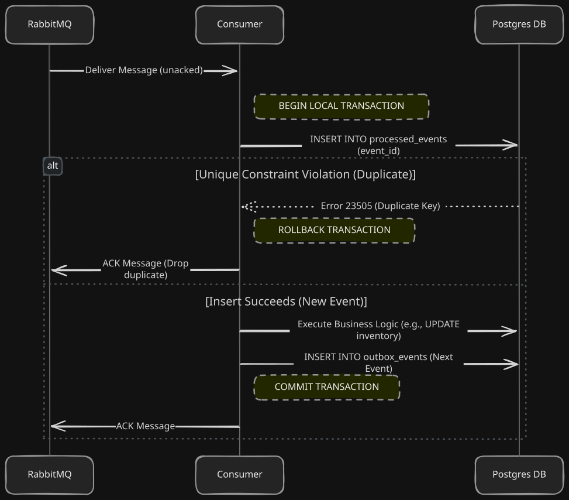

# ADR-003: Idempotent Consumers and Exactly-Once Semantics

## Context

In our choreographed Saga architecture, four services coordinate purely by publishing and consuming events on RabbitMQ. By design, RabbitMQ (like almost all distributed message brokers, including Kafka and SQS) guarantees **at-least-once delivery**. 

This means that under normal conditions, a message is delivered exactly once. However, if a consumer crashes after processing the business logic but before acknowledging the message, or if there is a network partition, RabbitMQ will redeliver the message. 

If a message is processed twice, the consequences in Chorus are catastrophic:
- The Inventory Service would reserve stock twice for a single order, leading to artificial stockouts.
- The Payment Service would charge a customer's credit card twice, leading to chargebacks and lost trust.
- The Shipping Service would dispatch two packages for a single order.

To build a reliable system, we cannot simply hope that duplicates won't happen. We must design our consumers to be structurally immune to them. We need to upgrade RabbitMQ's at-least-once delivery into **exactly-once processing semantics** at the application layer.

## Design Decisions

I had to make three key architectural decisions to solve this problem across our polyglot stack:

1. **Storage Mechanism:** Where and how to track which events have already been processed.
2. **Transaction Boundaries:** How to ensure the idempotency check is atomic with the business logic.
3. **Framework Implementation:** How to enforce this pattern consistently across Spring Boot (Java), NestJS (TypeScript), and Laravel (PHP).

---

## Decision 1: Database Table (`processed_events`) Over Redis

### The Redis Alternative I Rejected
A common (but flawed) approach to idempotency is using a fast key-value store like Redis. When an event arrives, the consumer checks Redis: `EXISTS event_id`. If false, it sets the key `SET event_id "processing"` and proceeds.

This fails because it introduces a **dual-write problem**. If the consumer successfully records the event in Redis, executes the business logic (e.g., reserving stock in Postgres), but crashes before committing the Postgres transaction, the system is permanently stuck. Redis says the event was processed, but the database rolled back. When RabbitMQ redelivers the message, the consumer will check Redis, see it as "processed," and skip it. The stock is never reserved, and the Saga halts forever.

### Why a Postgres Table is the Only Safe Choice
The only way to guarantee exactly-once processing is if the record of "I processed this event" is saved in the **exact same ACID transaction** as the business data mutation. 

We achieved this by creating a `processed_events` table in every service's Postgres database. 

```sql
CREATE TABLE processed_events (
    event_id UUID PRIMARY KEY,
    processed_at TIMESTAMP NOT NULL
);
```

By making `event_id` the Primary Key, the database itself enforces the idempotency through a **Unique Constraint Violation**. There is no "check then insert" race condition. We simply attempt to `INSERT`, and if the database rejects it with error code `23505` (Postgres Unique Violation), we know it's a duplicate.

---

## Decision 2: The Idempotent Transaction Boundary

The flow of every single consumer in the Chorus system must follow this exact transaction boundary. If a consumer deviates from this, it is not production-ready.



### Why We Manual ACK *After* the Commit
We explicitly disabled auto-acknowledgment (`spring.rabbitmq.listener.simple.acknowledge-mode=manual` in Spring, `{ noAck: false }` in amqplib). 

If we auto-acked the message the moment it arrived, and the database transaction failed (due to a deadlock or crash), the message would be gone forever, and the saga would stall. By waiting until the Postgres `COMMIT` succeeds before sending the `ACK` to RabbitMQ, we ensure no data is ever lost.

### Handling the "Crash Before ACK" Scenario
What happens if the database `COMMIT` succeeds, but the consumer process is OOM-killed exactly one millisecond before it can send the `ACK` to RabbitMQ?

1. RabbitMQ realizes the consumer connection dropped.
2. RabbitMQ redelivers the exact same message to another consumer pod.
3. The new consumer starts a transaction and attempts `INSERT INTO processed_events`.
4. The database rejects it (`23505 Unique Violation`) because the previous crashed process successfully committed that `event_id`.
5. The consumer catches the error, rolls back, and sends an `ACK` to RabbitMQ.

The business logic is protected. Exactly-once processing is achieved.

---

## Decision 3: Polyglot Implementations

Because Chorus is a polyglot system, we couldn't just write a single library. We had to implement this exact transaction boundary natively in three different paradigms. 

### Spring Boot (Order & Inventory)
In Java, it is tempting to use an AOP annotation like `@Idempotent`. I rejected this because AOP can obscure transaction boundaries, especially when combined with `@Transactional`. If the AOP aspect catches the duplicate exception but the transaction is already marked for rollback, it creates confusing proxy behavior.

Instead, I built an explicit `IdempotentConsumerTemplate`:

```java
@Transactional
public void process(UUID eventId, Runnable businessLogic) {
    try {
        processedEventRepository.saveAndFlush(new ProcessedEvent(eventId, Instant.now()));
    } catch (DataIntegrityViolationException e) {
        log.warn("Duplicate event: {}. Skipping.", eventId);
        return; 
    }
    businessLogic.run();
}
```
By forcing the developer to pass a `Runnable`, it is visibly obvious that the business logic and the idempotency check are participating in the exact same `@Transactional` context.

### NestJS (Payment)
NestJS (Node.js) is asynchronous and single-threaded. TypeORM's transaction handling can be tricky if you rely on global connection pools. To guarantee the boundary, I created an `IdempotencyService` that manually spins up a `QueryRunner`:

```typescript
const queryRunner = this.dataSource.createQueryRunner();
await queryRunner.startTransaction();
try {
    await queryRunner.manager.insert(ProcessedEvent, { eventId, processedAt: new Date() });
    await action(queryRunner.manager); // Business logic
    await queryRunner.commitTransaction();
} catch (error) {
    if (error.code === '23505') { // Native Postgres constraint violation
        await queryRunner.rollbackTransaction();
        return; // Safe exit for duplicate
    }
    throw error;
}
```
This forces developers to use the specific `queryRunner.manager` passed to their callback. If they accidentally use the global repository inside the callback, it would execute outside the transaction, breaking the guarantee. The callback signature `(manager: EntityManager) => Promise<void>` enforces correctness at compile time.

### Laravel (Shipping)
PHP/Laravel makes this arguably the cleanest of all three using `DB::transaction()` closures and Traits.

```php
try {
    DB::transaction(function () use ($eventId, $callback) {
        ProcessedEvent::insert(['event_id' => $eventId, 'processed_at' => now()]);
        $callback();
    });
} catch (QueryException $e) {
    if ($e->errorInfo[0] === '23505') {
        Log::info("Duplicate event {$eventId}");
        return;
    }
    throw $e;
}
```
The `QueryException` wraps the underlying PDO exception, and checking `errorInfo[0]` gives us direct access to the SQL state code.

## Summary

By relying on native database unique constraints (`event_id` as PK) rather than external caches, and wrapping every consumer in a strict transactional closure, we have eliminated the risk of duplicate processing.