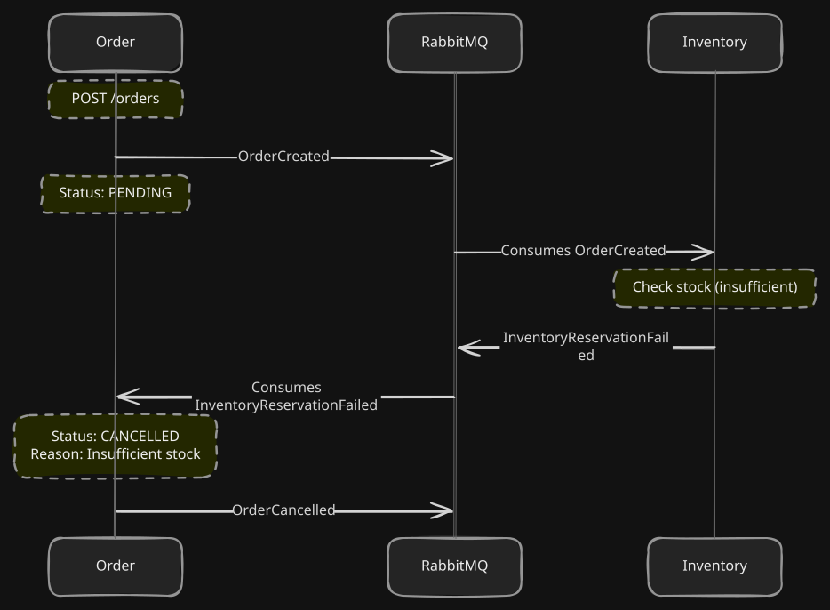
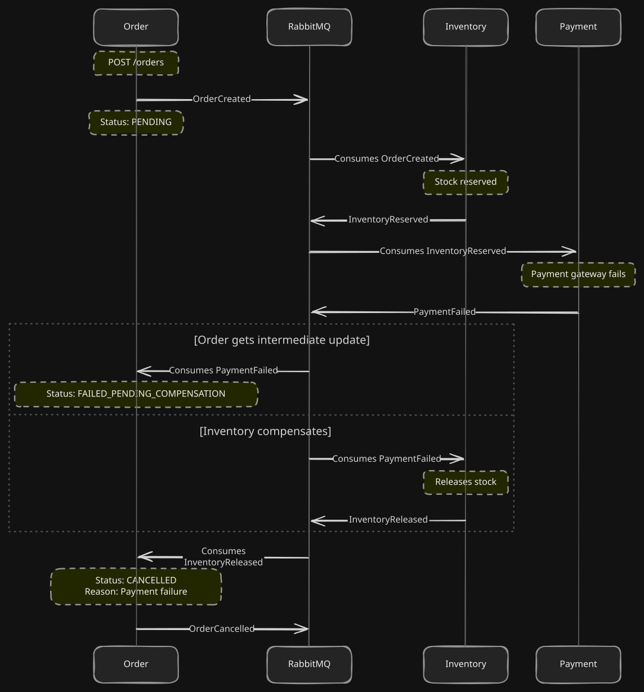
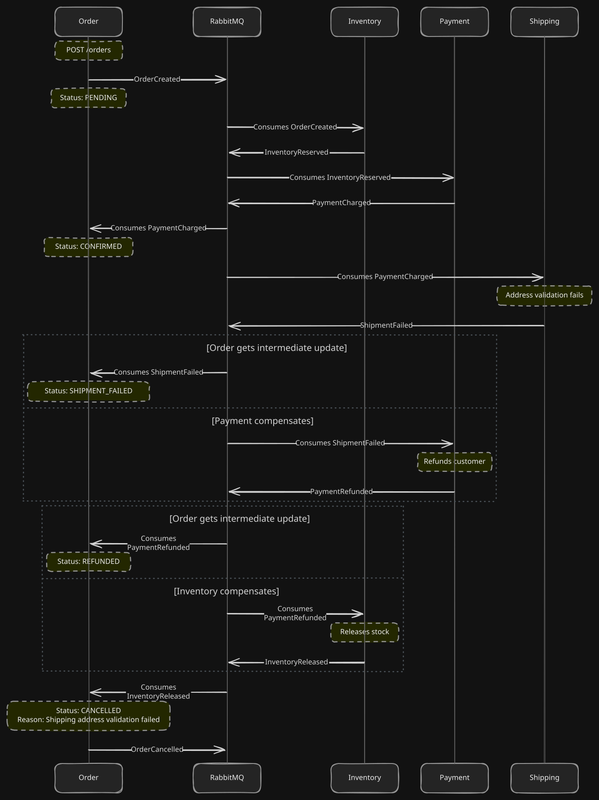

# ADR-004: Compensation as Forward Action, Not Rollback

## Context
In a distributed microservice architecture using the Choreographed Saga pattern, a single business transaction spans multiple independent services. For Chorus, creating an order involves Order, Inventory, Payment, and Shipping services.

If any step in the Saga fails, we must undo the work of the previous steps to maintain data consistency. However, because each step executes within its own local database transaction that has already been committed, we cannot simply issue a standard SQL `ROLLBACK`. The database transaction is already closed, and rolling back would violate the autonomy and isolation of the independent services.

## Decision
We model compensation as a **new forward action**, rather than attempting a technical rollback. This means that to "undo" an action, a service emits a new event that explicitly reverses the business effect of the previous action.

- To undo `InventoryReserved`, we emit `InventoryReleased`.
- To undo `PaymentCharged`, we emit `PaymentRefunded`.

These compensations are handled like any other event in our system, requiring idempotent consumers and their own Outbox pattern guarantees.

## Consequences
- **Auditability:** Every action, both original and compensation, is recorded in the database. Both a successful charge and a subsequent refund exist as independent auditable records, providing a clear history of what actually occurred in the business.
- **Narrative Events:** Events now tell a story. The `reason` field in failure events (e.g., `PaymentFailed`, `ShipmentFailed`) propagates backwards to the original Order, allowing the `OrderCancelled` event to accurately reflect the root cause of the failure.
- **Complexity in Cascading Compensations:** Compensation chains can cascade. The failure of the final step (Shipping) requires two preceding compensations (Payment, then Inventory). This requires careful orchestration of the compensation sequence.

## Compensation Flow Diagrams

Below are the detailed Mermaid sequence diagrams illustrating the exact event flow for each compensation path in our Saga.

### 1. Inventory Failure
This is the simplest compensation path. If stock cannot be reserved, no other actions have been committed yet, so the Order is immediately cancelled.

### 2. Payment Failure
If payment fails, we must compensate the one prior step that succeeded: Inventory Reservation.

### 3. Shipment Failure
This is the longest compensation chain. A shipment failure requires refunding the payment, which in turn requires releasing the inventory.

