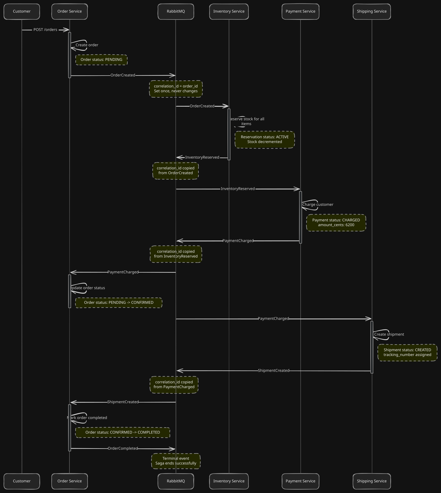
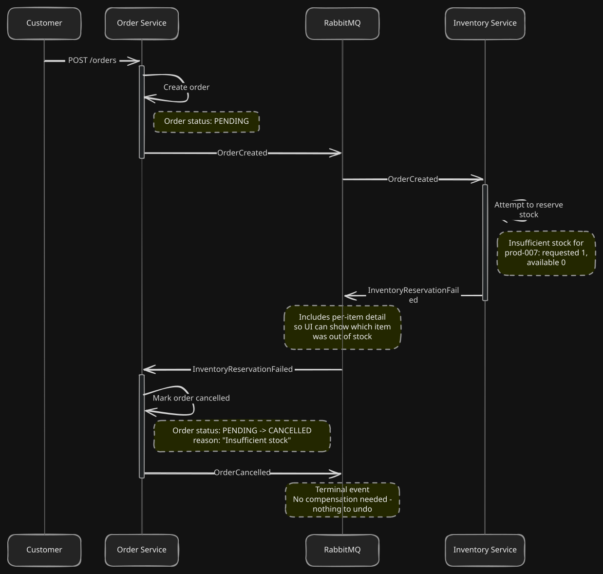
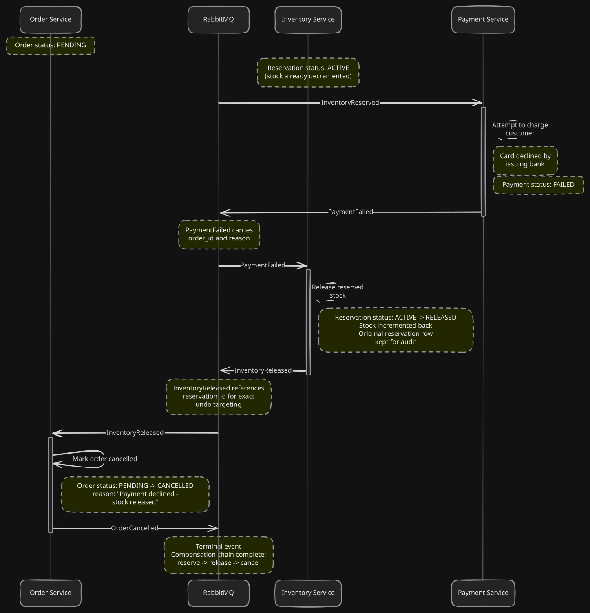
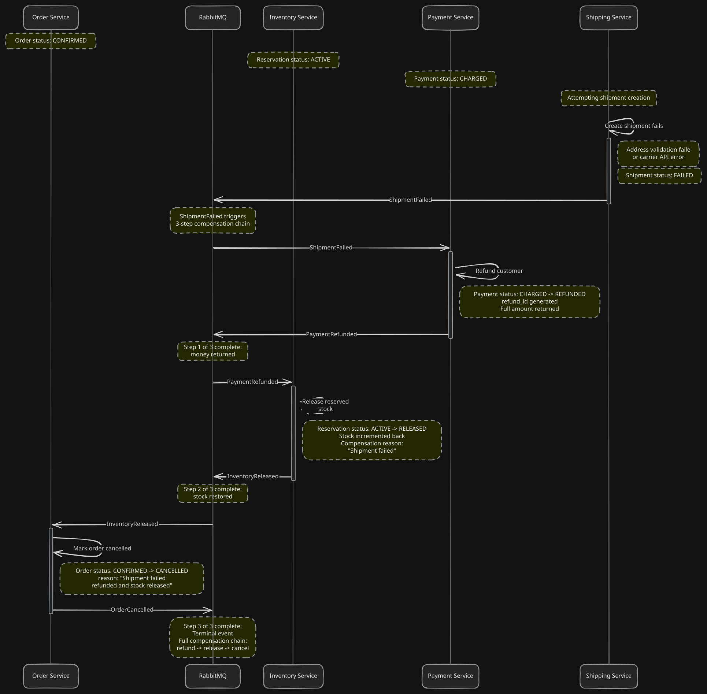
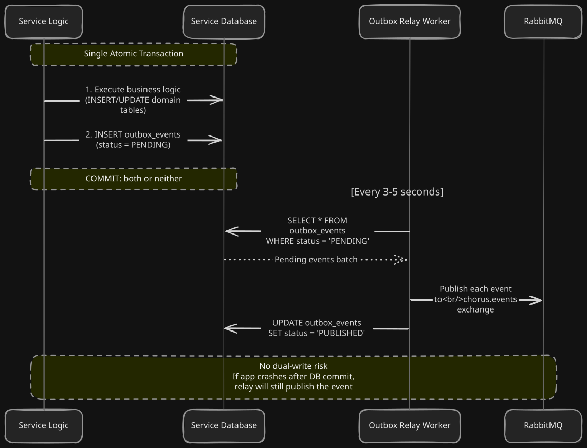
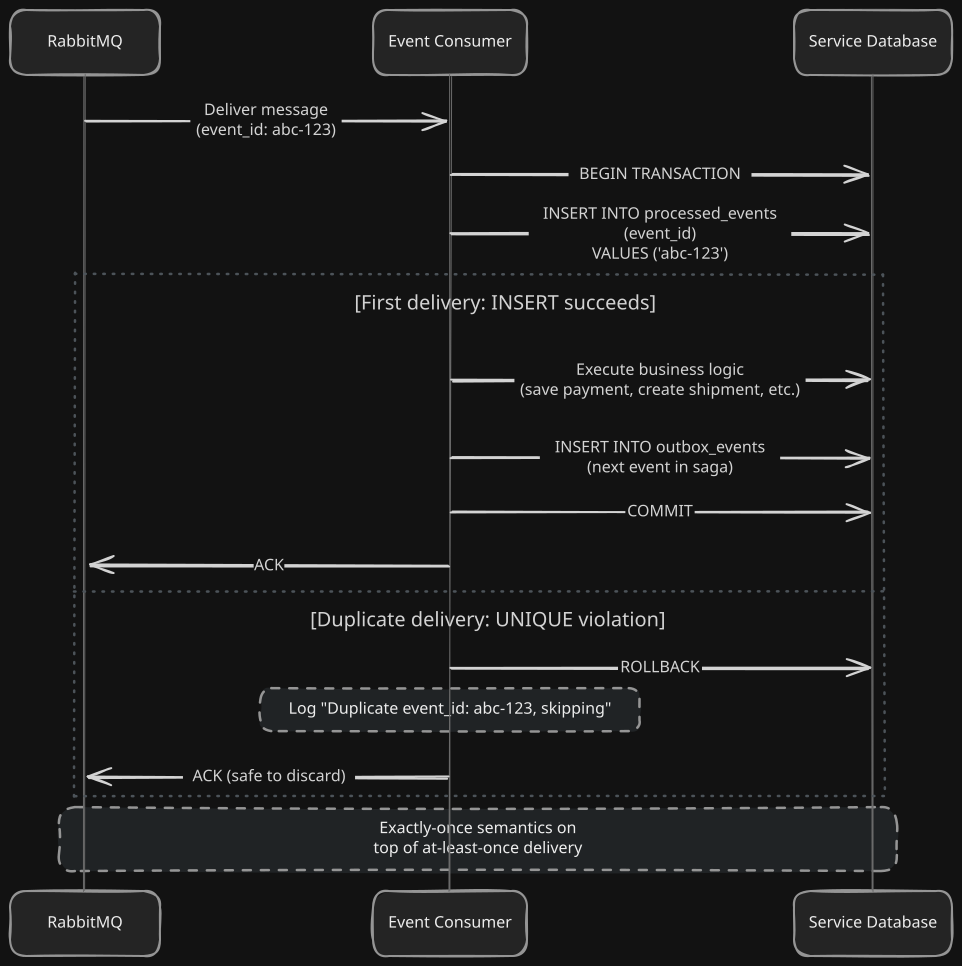
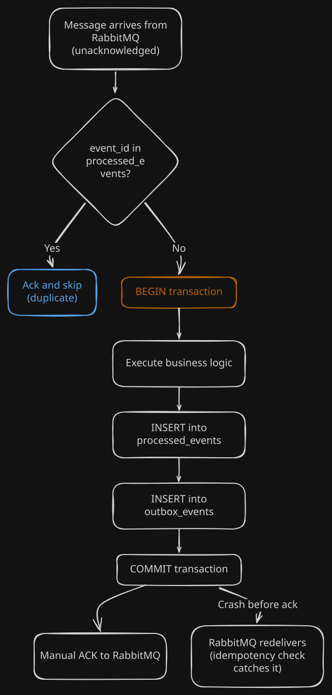
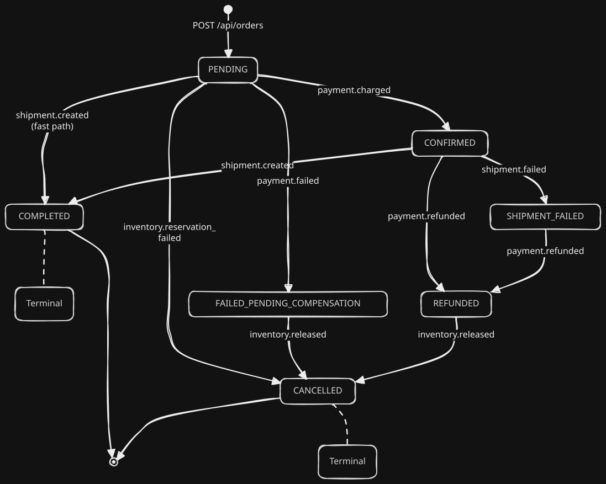
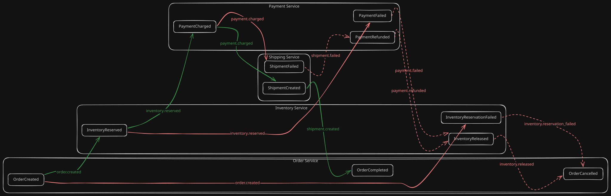

# Chorus: Architecture & Diagrams

> Comprehensive visual documentation for my Chorus event-driven microservices system.
> All diagrams use Mermaid syntax and render natively on GitHub.

---

## 1. System Overview

---

## 2. Happy Path: Saga Sequence Diagram

This is the golden path: an order flows through all four of my services and completes successfully.

---

## 3. Compensation Path 1: Inventory Reservation Failure

When stock is insufficient, my saga short-circuits immediately.

---

## 4. Compensation Path 2: Payment Failure

If payment fails after inventory was reserved, the stock must be released.

---

## 5. Compensation Path 3: Shipment Failure

If shipment fails after payment succeeded, I execute a full rollback: refund the payment and release the stock.

---

## 6. Transactional Outbox Pattern

Every service I built uses this same pattern to guarantee zero message loss without any dual-write risk.

---

## 7. Idempotent Consumer Pattern

Every consumer uses transactional idempotency to guarantee exactly-once processing.

---

## 8. Order State Machine

My Order service enforces a strict state machine to prevent race conditions.

---

## 9. RabbitMQ Topology

---

## 10. Event Flow Diagram

## 11. Event Catalog: Complete Flow Map

| # | Event | Producer | Routing Key | Consumer(s) | Action |
|---|---|---|---|---|---|
| 1 | `OrderCreated` | Order | `order.created` | Inventory, Trace | Reserve stock |
| 2 | `InventoryReserved` | Inventory | `inventory.reserved` | Payment, Order, Trace | Charge payment |
| 3 | `InventoryReservationFailed` | Inventory | `inventory.reservation_failed` | Order, Trace | Cancel order |
| 4 | `PaymentCharged` | Payment | `payment.charged` | Shipping, Order, Trace | Create shipment, confirm order |
| 5 | `PaymentFailed` | Payment | `payment.failed` | Inventory, Order, Trace | Release stock, begin cancellation |
| 6 | `ShipmentCreated` | Shipping | `shipment.created` | Order, Trace | Complete order |
| 7 | `ShipmentFailed` | Shipping | `shipment.failed` | Payment, Order, Trace | Refund payment |
| 8 | `PaymentRefunded` | Payment | `payment.refunded` | Inventory, Order, Trace | Release stock |
| 9 | `InventoryReleased` | Inventory | `inventory.released` | Order, Trace | Cancel order |
| 10 | `OrderCompleted` | Order | `order.completed` | Trace | Terminal event |
| 11 | `OrderCancelled` | Order | `order.cancelled` | Trace | Terminal event |

---

## 12. Infrastructure & Ports

| Component | Technology | Port | Container |
|---|---|---|---|
| Order Service | Java 21 / Spring Boot 3.4 | 8081 | Local (JVM) |
| Inventory Service | Java 21 / Spring Boot 3.4 | 8082 | Local (JVM) |
| Payment Service | Node.js / NestJS / TypeScript | 8083 | Local (Node) |
| Shipping Service | PHP 8.2 / Laravel 11 | 8084 | Local (PHP) |
| PostgreSQL | PostgreSQL 15 Alpine | 5432 | `chorus-postgres` |
| RabbitMQ | RabbitMQ 3 Management | 5672 / 15672 | `chorus-rabbitmq` |

---