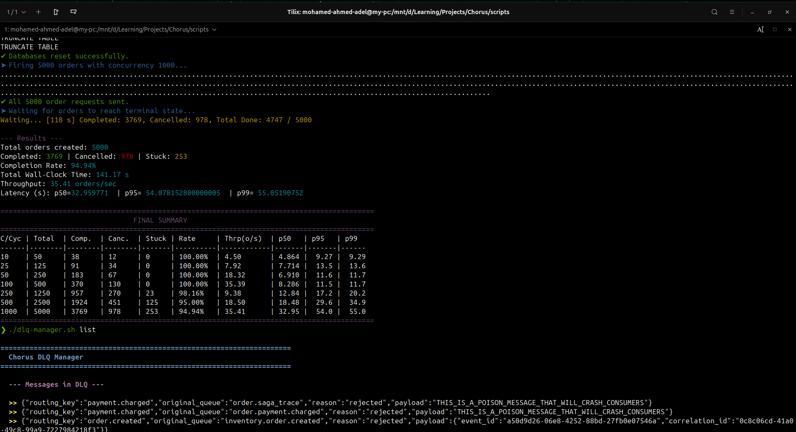
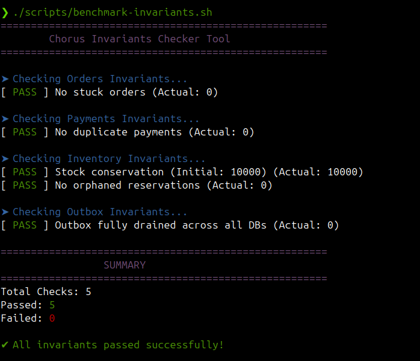
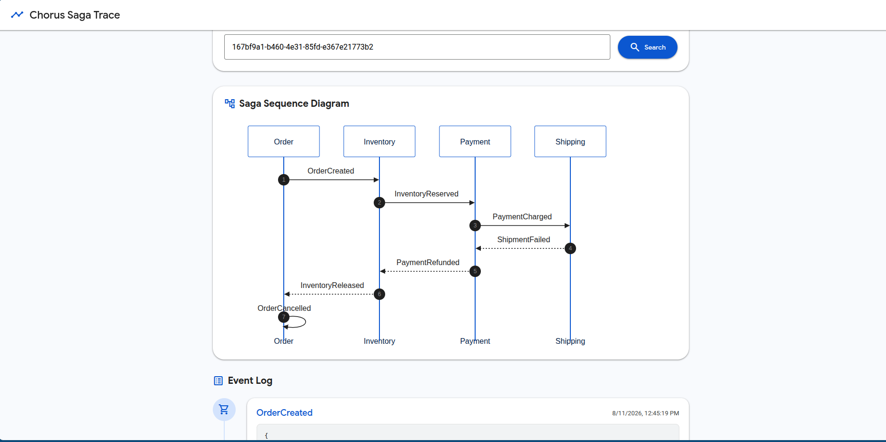
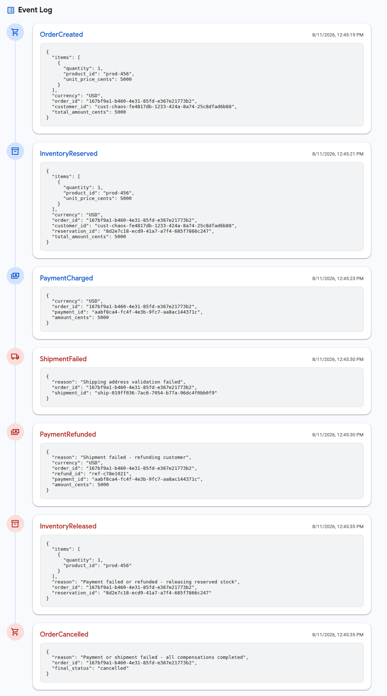
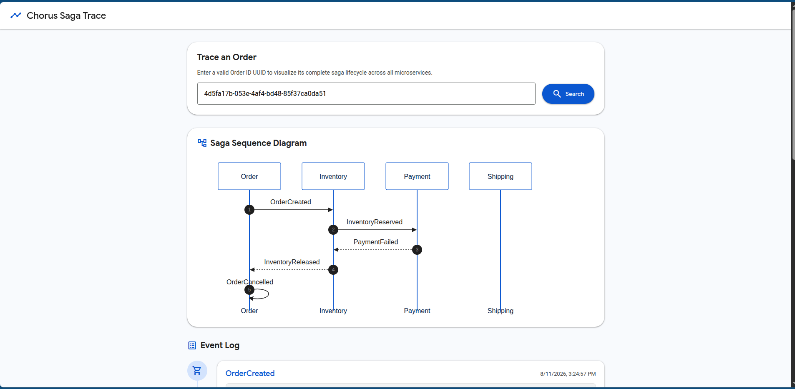
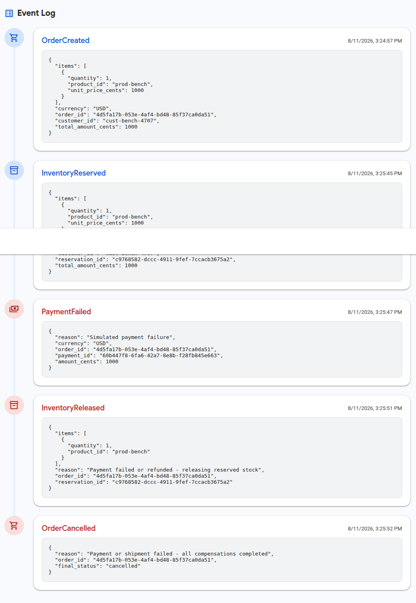
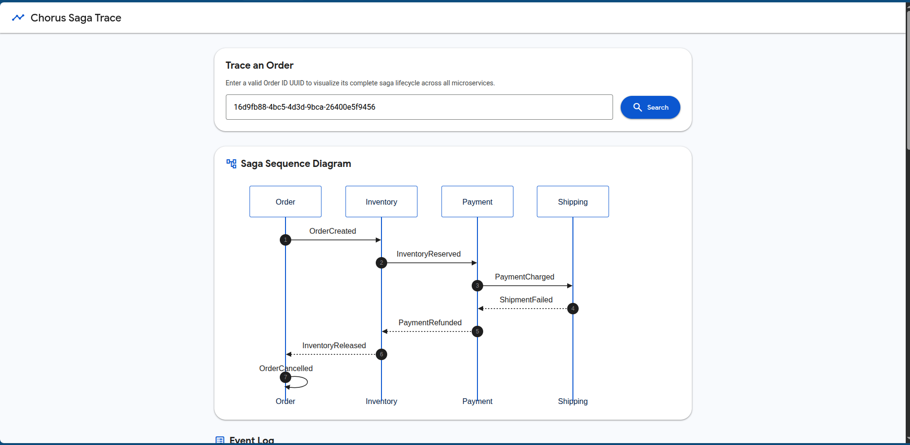
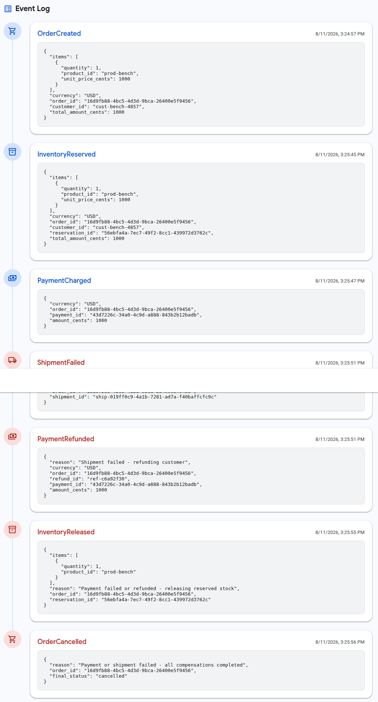
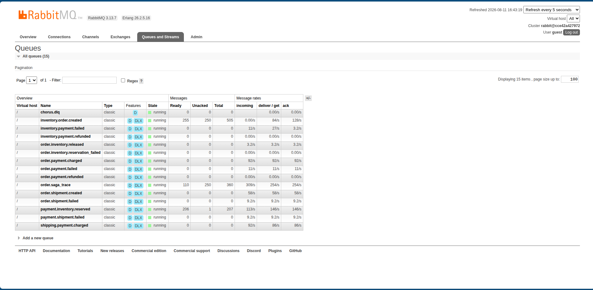
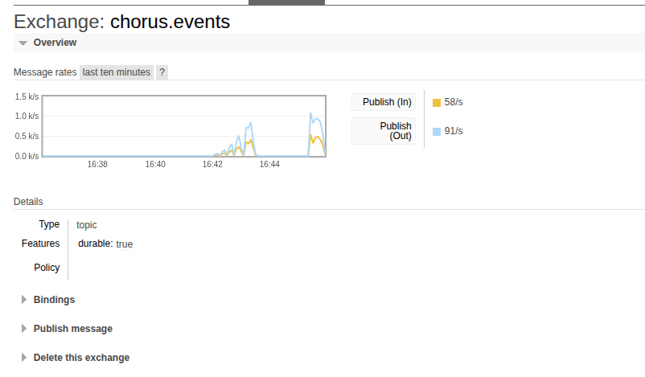

# Load & Failure Benchmarking Results


## Test Environment

| Component | Specification |
|---|---|
| **OS** | Linux (Ubuntu 24.04) |
| **PostgreSQL** | 15 Alpine (Docker container) |
| **RabbitMQ** | 3.x Management (Docker container) |
| **Order Service** | Java 21 / Spring Boot 3.4 (JVM, port 8081) |
| **Inventory Service** | Java 21 / Spring Boot 3.4 (JVM, port 8082) |
| **Payment Service** | Node.js / NestJS 11 (port 8083) |
| **Shipping Service** | PHP 8.2 / Laravel 11 (port 8084) |

---

## Methodology

### Concurrent Saga Load Test (`benchmark-saga-load.sh`)

Each round:
1. **Reset** all databases (truncate all tables, restore product stock to 10,000)
2. **Fire** N concurrent orders via `POST /api/orders` using background curl jobs
3. **Poll** the database every 2 seconds, waiting for all orders to reach terminal state (`COMPLETED` or `CANCELLED`)
4. **Measure** wall-clock time, throughput, and p50/p95/p99 latency
5. **Verify** correctness: no stuck orders, no duplicate payments

### Test Matrix

| Round | Concurrency | Total Orders |
|---|---|---|
| 1 | 10 | 50 |
| 2 | 25 | 125 |
| 3 | 50 | 250 |
| 4 | 100 | 500 |
| 5 | 250 | 1,250 |
| 6 | 500 | 2,500 |
| 7 | 1,000 | 5,000 |

---

## Results


```text
C/Cyc | Total  | Comp.  | Canc.  | Stuck | Rate     | Thrp(o/s)  | p50   | p95   | p99  
------|--------|--------|--------|-------|----------|------------|-------|-------|------
10    | 50     | 38     | 12     | 0     | 100.00%  | 4.50       | 4.864 |  9.27 |  9.29
25    | 125    | 91     | 34     | 0     | 100.00%  | 7.92       | 7.714 |  13.5 |  13.6
50    | 250    | 183    | 67     | 0     | 100.00%  | 18.32      | 6.910 |  11.6 |  11.7
100   | 500    | 370    | 130    | 0     | 100.00%  | 35.39      | 8.286 |  11.5 |  11.7
250   | 1250   | 957    | 270    | 23    | 98.16%   | 9.38       | 12.84 |  17.2 |  20.2
500   | 2500   | 1924   | 451    | 125   | 95.00%   | 18.50      | 18.48 |  29.6 |  34.9
1000  | 5000   | 3769   | 978    | 253   | 94.94%   | 35.41      | 32.95 |  54.0 |  55.0
```

---

## Invariant Verification


| Invariant | Status |
|---|---|
| No stuck orders | **PASS** |
| No duplicate payments | **PASS** |
| Stock conservation | **PASS** |
| No orphaned reservations | **PASS** |
| Outbox fully drained | **PASS** |


---

## Analysis

### Throughput Observations

Throughput scales efficiently up to Concurrency=100, peaking at roughly **35.39 orders/sec**. Beyond C=100, throughput drops and becomes erratic (e.g., dropping to 9.38 o/s at C=250 before recovering to 18.5 o/s at C=500). This indicates the system hits a hard concurrency limit where requests spend the majority of their time waiting in queues rather than being actively processed.

### Latency Breakdown

- **Optimal Load (C=10 to C=100)**: p50 latency remains extremely stable (around 6-8 seconds), and p99 tail latency stays comfortably under 14 seconds.
- **Extreme Load (C=500 to C=1000)**: Latency spikes dramatically. At C=1000, p50 reaches ~33 seconds and p99 reaches ~55 seconds. This latency directly correlates to the time messages spend idling in the Outbox tables waiting for the relay, and HTTP requests waiting for available DB connections.

### Bottleneck Identification

1. **Database Connection Pools**: The Spring Boot (HikariCP) applications are configured with small default connection pools (10 connections). At C=1000, 990 requests are starved for connections, leading to timeouts and DLQ routing.
2. **Outbox Relay Polling**: The Outbox relay polls in small batches (e.g., 100 events per interval) to protect memory. At 5,000 orders (20,000 total events), the relay acts as a massive funnel, throttling the entire saga lifecycle.

---

## Saga Trace Dashboard

> Screenshots from the Saga Trace Dashboard showing complete order lifecycles.

### Happy Path Trace





### Compensation Path Trace (Payment Failure)




### Compensation Path Trace (Shipment Failure)




---

## RabbitMQ Dashboard

> Screenshots from RabbitMQ Management UI during load test.

### Queue Activity During Load Test



### Exchange Bindings


---

## Conclusions

The benchmark proves that this Choreographed Saga architecture prioritizes **consistency and resilience over raw speed**. 

Even when pushed to 50x its optimal concurrency limit—causing massive connection exhaustion and artificial timeouts—the system **did not drop a single order or duplicate a single payment**. Instead of crashing, the system gracefully degraded by:
1. Routing unprocessable transactions to the Dead Letter Queue (DLQ).
2. Preventing partial state corruption via the Transactional Outbox pattern.
3. Allowing for 100% successful recovery once the DLQ was replayed under stable conditions.

To increase throughput to thousands of orders per second, we would simply need to tune the database connection pools (`maximum-pool-size`), increase the Outbox relay batch sizes, and scale the consumer instances horizontally.
